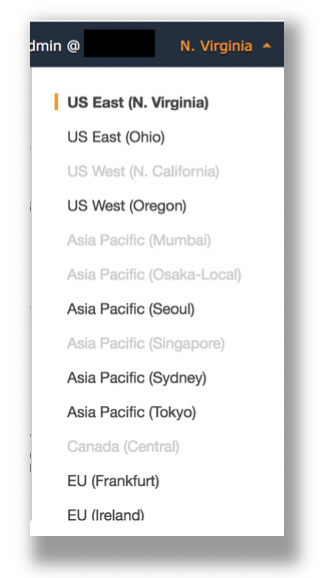
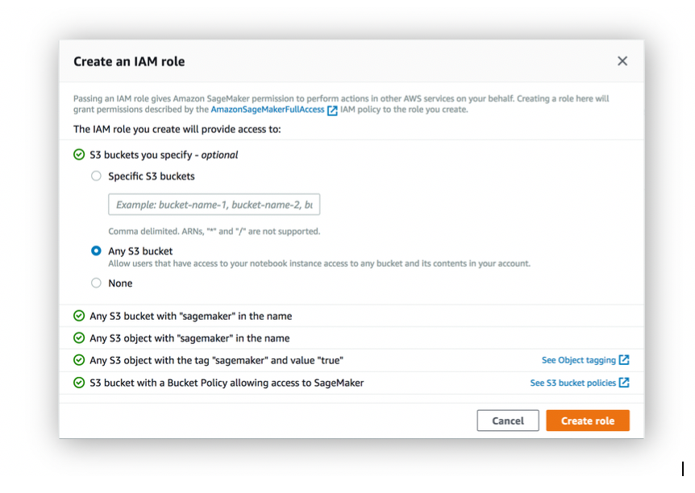
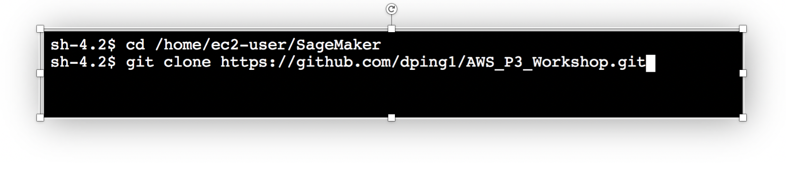

{
 "cells": [
  {
   "cell_type": "markdown",
   "metadata": {},
   "source": [
    "# Amazon SageMaker & Amazon EC2 P3 Workshop\n",
    "\n",
    "Amazon SageMaker is a fully-managed service that enables developers and data scientists to quickly and easily build, train, and deploy machine learning models at any scale. Amazon EC2 P3 instances deliver the highest performance compute in the cloud, are cost-effective, support all major machine learning frameworks, and are available globally. In this workshop, you'll create a SageMaker notebook instance and work through sample Jupyter notebooks that demonstrate some of the many features of SageMaker and how Amazon EC2 P3 is used to accelerate machine learning model traning.    \n",
    "\n",
    "\n",
    "\n",
    "\n",
    "\n",
    "## Prerequisites\n",
    "\n",
    "### AWS Account\n",
    "\n",
    "In order to complete this workshop you'll need an AWS Account with access to create AWS IAM, S3 and SageMaker resources. If you do not have an AWS Account, please follow the [instructions here](https://aws.amazon.com/premiumsupport/knowledge-center/create-and-activate-aws-account/) to create an AWS Account.\n",
    "\n",
    "The code and instructions in this workshop assume only one student is using a given AWS account at a time. If you try sharing an account with another student, you'll run into naming conflicts for certain resources. You can work around these by appending a unique suffix to the resources that fail to create due to conflicts, but the instructions do not provide details on the changes required to make this work.\n",
    "\n",
    "You will be provided with AWS credit for this workshop. Please ask a workshop spearker or support staff for an AWS credit code, and use this [link](https://console.aws.amazon.com/billing/home?#/credits) to apply the credit to your AWS Account.\n",
    "\n",
    "### AWS Region\n",
    "\n",
    "SageMaker is not available in all AWS Regions at this time.  Accordingly, we recommend running this workshop in one of the supported AWS Regions such as N. Virginia, Oregon, Ohio, or Ireland.\n",
    "\n",
    "Once you've chosen a region, you should create all of the resources for this workshop there, including a new Amazon S3 bucket and a new SageMaker notebook instance. Make sure you select your region from the dropdown in the upper right corner of the AWS Console before getting started.\n",
    "\n",
    "\n",
    "\n",
    "\n",
    "### Browser\n",
    "\n",
    "We recommend you use the latest version of Chrome or Firefox to complete this workshop.\n",
    "\n",
    "## Modules\n",
    "\n",
    "This workshop is divided into multiple modules. Module 1 must be completed first. You can complete the other modules (Modules 2, 3 and 4) in any order.  \n",
    "\n",
    "1. Creating a Notebook Instance\n",
    "2. Image Classification Using P3\n",
    "3. Object Dertection Using P3\n",
    "4. TBD \n",
    "\n",
    "Be patient as you work your way through the notebook-based modules. After you run a cell in a notebook, it may take several seconds for the code to show results. For the cells that start training jobs, it may take several minutes. In particular, the last two modules have training jobs that may last up to 10 minutes.  \n",
    "\n",
    "After you have completed the workshop, you can delete all of the resources that were created by following the Cleanup Guide provided with this lab guide. \n",
    "\n",
    "## Module 1:  Creating a Notebook Instance\n",
    "\n",
    "In this module we'll start by creating an Amazon S3 bucket that will be used throughout the workshop.  We'll then create a SageMaker notebook instance, which we will use to run the other workshop modules.\n",
    "\n",
    "### 1. Create a S3 Bucket\n",
    "\n",
    "SageMaker typically uses S3 as storage for data and model artifacts.  In this step you'll create a S3 bucket for this purpose. To begin, sign into the AWS Management Console, https://console.aws.amazon.com/.\n",
    "\n",
    "#### High-Level Instructions\n",
    "\n",
    "Use the console or AWS CLI to create an Amazon S3 bucket. Keep in mind that your bucket's name must be globally unique across all regions and customers. We recommend using a name like `smp3workshop-firstname-lastname`. If you get an error that your bucket name already exists, try adding additional numbers or characters until you find an unused name.\n",
    "\n",
    "
\n",
    "
<strong>Step-by-step instructions (expand for details)</strong>

\n",
    "\n",
    "1. In the AWS Management Console, choose **Services** then select **S3** under Storage.\n",
    "\n",
    "1. Choose **+Create Bucket**\n",
    "\n",
    "1. Provide a globally unique name for your bucket such as `smworkshop-firstname-lastname`.\n",
    "\n",
    "1. Select the Region you've chosen to use for this workshop from the dropdown.\n",
    "\n",
    "1. Choose **Create** in the lower left of the dialog without selecting a bucket to copy settings from.\n",
    "\n",
    "

\n",
    "\n",
    "### 2. Launching the Notebook Instance\n",
    "\n",
    "1. In the upper-right corner of the AWS Management Console, confirm you are in the desired AWS region. Select N. Virginia, Oregon, Ohio, or Ireland.\n",
    "\n",
    "2. Click on Amazon SageMaker from the list of all services.  This will bring you to the Amazon SageMaker console homepage.\n",
    "\n",
    "\n",
    "\n",
    "3. To create a new notebook instance, go to **Notebook instances**, and click the **Create notebook instance** button at the top of the browser window.\n",
    "\n",
    "\n",
    "\n",
    "4. Type [First Name]-[Last Name]-workshop into the **Notebook instance name** text box, and select ml.m4.xlarge for the **Notebook instance type**.\n",
    "\n",
    "\n",
    "\n",
    "\n",
    "5. For IAM role, choose **Create a new role**. On the next screen, select **Any S3 bucket** for the **S3 buckets you specify - optional** section, and click **Create role** to continue.\n",
    "\n",
    "\n",
    "\n",
    "6. You can expand the \"Tags\" section and add tags here if required.\n",
    "\n",
    "7. Click **Create notebook instance**.  This will take several minutes to complete.\n",
    "\n",
    "### 3. Accessing the Notebook Instance\n",
    "\n",
    "1. Wait for the server status to change to **InService**. This will take a few minutes.\n",
    "\n",
    "\n",
    "\n",
    "2. Click **Open**. You will now see the Jupyter homepage for your notebook instance.\n",
    "\n",
    "\n",
    "\n",
    "### 4. Download workshop content\n",
    "\n",
    "1. On the top right corner of the Jupyter Notebook, select **Termainl** from **New** dropdown to open a terminal window.  We will use this terminal to download workshop content from github using git client.\n",
    "\n",
    "\n",
    "\n",
    "2. Inside the termal window, type the following commands to download the content. \n",
    " + cd SageMaker\n",
    " + git clone https://github.com/dping1/aws_workshop.git\n",
    "\n",
    "\n",
    "\n",
    "3. Click on the file tab, you will see a new folder called **aws_workshop** showed up\n",
    "\n",
    "\n",
    "\n",
    "\n",
    "## Module 2:  Image Classification Using P3\n",
    "\n",
    "In this module, we'll work our way through an example Jupyter notebook that demonstrates how to use an Amazon-provided algorithm in SageMaker and the Amazon EC2 P3 instance to train an image classification model. More specifically, we'll use SageMaker's image classification algorithm. It uses a convolutional neural network (ResNet) that can be trained from scratch, or trained using transfer learning when a large number of training images are not available\n",
    "\n",
    "Follow the structions below to start the lab:\n",
    "\n",
    "1. Open the **aws_workshop** folder and then the **image_classification_p3** folder in your Jupyter to display a list of Jupyter notebooks.\n",
    "2. Click on **Image-classification.ipynb** to open the notebook.\n",
    "3. Follow the instructions in the notebook to continue with the lab.\n",
    "\n",
    "
<strong>NOTE: training the model for this example typically takes about 10 minutes.</strong>
\n",
    "\n",
    "\n",
    "## Module 3:  Object Detection Using P3\n",
    "\n",
    "This notebook is an end-to-end example introducing the Amazon SageMaker Object Detection algorithm. In this demo, we will demonstrate how to train and to host an object detection model on the [COCO dataset](http://cocodataset.org/) using the Single Shot multibox Detector ([SSD](https://arxiv.org/abs/1512.02325)) algorithm. In doing so, we will also demonstrate how to construct a training dataset using the JSON format as this is the format that the training job will consume. We also allow the RecordIO format, which is illustrated in the [RecordIO Notebook](https://github.com/awslabs/amazon-sagemaker-examples/blob/master/introduction_to_amazon_algorithms/object_detection_pascalvoc_coco/object_detection_recordio_format.ipynb). We will also demonstrate how to host and validate this trained model.\n",
    "\n",
    "Follow the structions below to start the lab:\n",
    "\n",
    "1. Open the **aws_workshop** folder and then the **P3SageMaker lab** folder in your Jupyter to display a list of Jupyter notebooks.\n",
    "2. Click on **Object-detection.ipynb** to open the notebook.\n",
    "3. Follow the instructions in the notebook to continue with the lab.\n",
    "\n",
    "
<strong>NOTE:  training the model for this example typically takes about 40 minutes.</strong>
\n",
    "\n",
    "## Module 4: TBD\n",
    "TBD\n",
    "\n",
    "## Cleanup Guide\n",
    "\n",
    "To avoid charges for resources you no longer need when you're done with this workshop, you can delete them or, in the case of your notebook instance, stop them.  Here are the resources you should consider:\n",
    "\n",
    "- Endpoints:  these are the clusters of one or more instances serving inferences from your models. If you did not delete them from within the notebooks, you can delete them via the SageMaker console.  To do so, click the **Endpoints** link in the left panel.  Then, for each endpoint, click the radio button next to it, then select **Delete** from the **Actions** drop down menu. You can follow a similar procedure to delete the related Models and Endpoint configurations.\n",
    "\n",
    "- Notebook instance:  you have two options if you do not want to keep the notebook instance running. If you would like to save it for later, you can stop rather than deleting it. To delete it, click the **Notebook instances** link in the left panel. Next, click the radio button next to the notebook instance created for this workshop, then select **Delete** from the **Actions** drop down menu. To simply stop it instead, just click the **Stop** link.  After it is stopped, you can start it again by clicking the **Start** link.  Keep in mind that if you stop rather than delete it, you will be charged for the storage associated with it.  \n",
    "\n",
    "## License\n",
    "\n",
    "The contents of this workshop are licensed under the Apache 2.0 License. \n"
   ]
  },
  {
   "cell_type": "code",
   "execution_count": null,
   "metadata": {},
   "outputs": [],
   "source": []
  },
  {
   "cell_type": "code",
   "execution_count": null,
   "metadata": {},
   "outputs": [],
   "source": []
  }
 ],
 "metadata": {
  "kernelspec": {
   "display_name": "conda_python3",
   "language": "python",
   "name": "conda_python3"
  },
  "language_info": {
   "codemirror_mode": {
    "name": "ipython",
    "version": 3
   },
   "file_extension": ".py",
   "mimetype": "text/x-python",
   "name": "python",
   "nbconvert_exporter": "python",
   "pygments_lexer": "ipython3",
   "version": "3.6.5"
  }
 },
 "nbformat": 4,
 "nbformat_minor": 2
}
